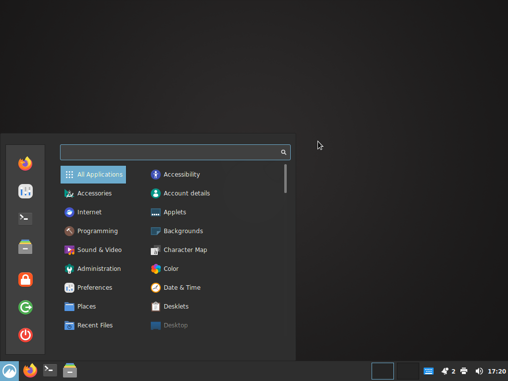
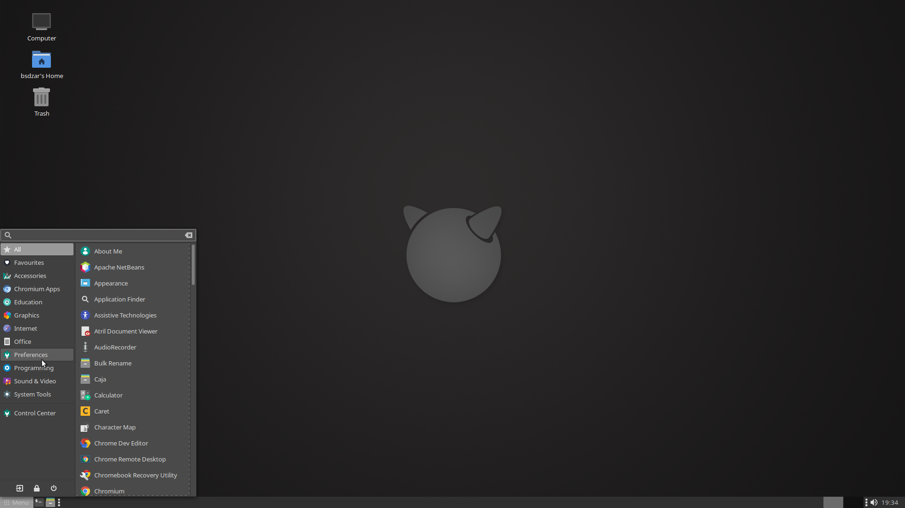
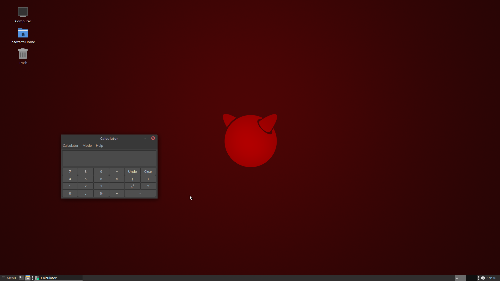

# MakBSD installer Script
a Desktop install script system for FreeBSD and derivates

This is a fork of this repository: https://github.com/broozar/installDesktopFreeBSD

## About
This script will transform a standard installation of FreeBSD into a desktop system by bootstrapping PKG, adding Xorg, a desktop environment with theming, some optional desktop software, a login manager, and set up users.

## Usage
1. Install a minimal image of FreeBSD in *Bios/MBR* mode (not UEFI), select *with sources* if you plan on using nVidia drivers, and *do not* create any additional users.
2. Boot your new FreeBSD system and log in as *root*.
3. Navigate to yout */tmp* directory, fetch the release archive, and run it:
```
$ cd /tmp
$ fetch https://trisymphony.com/fbsdesk
$ tar zxf fbsdesk
$ sh main.sh
```
4. Follow the instructions on screen. If you made a mistake, use CTRL+C to abort, then simply run the script again.

## Keyboard Shortcuts
- SUPER+left, SUPER+right: tile windows left/right
- SUPER+up: maximize window
- SUPER+down: minimize window
- SUPER+e: launch file manager
- SUPER+t: launch terminal
- SUPER+b: launch browser

## Wallpapers and icons
Custom wallpapers and icons are located at
- /usr/local/share/backgrounds/fbsdesktop
- /usr/local/share/icons/fbsdesktop

## Screenshots
### Cinnamon

### Mate



## Keyboard codes without dialog
If you do not use the new dialog UI, the script will ask you to define your keyboard layout. If you go with the defaults, you will be getting the standard US layout. A full list of language and variant codes can be found here: https://unix.stackexchange.com/questions/43976/list-all-valid-kbd-layouts-variants-and-toggle-options-to-use-with-setxkbmap

The layout can be changed later at any point. 
- For MATE, simply navigate to the Keyboard Settings. 
- For SLiM, edit the file */etc/X11/xorg.conf.d/10-keyboard.conf*

## Untested
- My hardware selection is limited. Only current nVidia drivers and AMDGPU are tested. If you have older hardware and/or intel graphics, please let me know if/how it works.

## Differences to original script

I added the possibility to install other desktop environments: kde plasma & xfce, and obviously I also added the installation of sddm among the login managers

(for now I am without customizations, in the future I will change the DE customization)

## Credits
- dialog by Thomas E. Dickey https://invisible-island.net/dialog/
- icon theme is PAPIRUS https://github.com/PapirusDevelopmentTeam/papirus-icon-theme
- desktop theming guide by olivierd https://forums.freebsd.org/threads/gschema-override-not-holding.69973/#post-422183
- Arc Grey Theme avaialble on https://github.com/pinpox/arc-grey-theme, retrieved from https://www.gnome-look.org/p/1135255/
